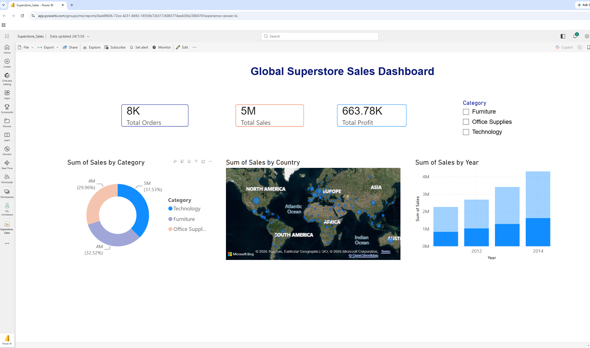

# Global Superstore Sales Dashboard

An interactive Power BI portfolio project for exploring the performance of a fictional global retailer across products, markets, countries, and years.



## Project overview

The dashboard turns transaction-level superstore data into an executive sales view. It is designed to help users quickly assess overall performance and then narrow the analysis by product category, geography, and year.

### Dashboard features

- KPI cards for orders, sales, and profit
- Category slicer for interactive filtering
- Sales contribution by product category
- Geographic sales distribution on a world map
- Yearly sales comparison from 2011 to 2014
- A clean, single-page layout for rapid business review

## Dataset profile

The included CSV contains fictional sample retail transactions:

| Metric | Audited value |
|---|---:|
| Transaction rows | 51,290 |
| Distinct orders | 25,035 |
| Countries | 147 |
| Years | 2011–2014 |
| Product categories | 3 |
| Total sales | $12,642,905.00 |
| Total profit | $1,467,457.29 |

The three product categories are Furniture, Office Supplies, and Technology.

## Tools and skills demonstrated

- Microsoft Power BI
- Data modelling and aggregation
- KPI and dashboard design
- Interactive filtering and slicing
- Geographic and time-series visualisation
- Business intelligence storytelling
- Data validation and repository documentation

## Repository structure

```text
Global-Superstore-PowerBI-Dashboard/
├── dashboard/
│   └── Superstore_Sales.pbix
├── data/
│   ├── Global_Superstore.csv
│   └── README.md
├── images/
│   └── PowerBI_Dashboard.png
├── .gitattributes
├── .gitignore
└── README.md
```

## Open the dashboard

1. Install [Microsoft Power BI Desktop](https://powerbi.microsoft.com/desktop/).
2. Clone this repository:

   ```bash
   git clone https://github.com/krupashok/Global-Superstore-PowerBI-Dashboard.git
   ```

3. Open `dashboard/Superstore_Sales.pbix` in Power BI Desktop.
4. If Power BI asks for the data source, point it to `data/Global_Superstore.csv`.
5. Select **Refresh** to reload the model, then use the category slicer and visuals to explore the report.

> The PBIX stores its saved report model, so the dashboard can still be viewed before a manual refresh.

## Data quality and validation notes

- The supplied `Order Date` and `Ship Date` columns contain the placeholder value `00:00.0`. The retained `Year` and `weeknum` fields support the existing time-based analysis.
- The audited totals above are calculated directly from the full CSV. Dashboard cards reflect the saved Power BI model and its report/filter context, so their displayed values may differ from unfiltered raw-file totals.
- The file was checked for obvious credentials, email addresses, and local filesystem paths before publication; none were found.
- Customer names and identifiers belong to the fictional sample dataset and are not presented as real customer information.

More detail is available in the [data documentation](data/README.md).

## Data source and usage notice

This repository uses a transformed Global Superstore sample dataset for educational and portfolio purposes. Tableau describes Superstore as fictional sample data and provides sample datasets through its learning resources: [Tableau Sample Data](https://public.tableau.com/app/learn/sample-data?qt-overview_resources=1).

The original data remains subject to its source terms. This repository does not grant a separate licence for the included dataset.

## Author

**Krupa Palani Ashoka**

- [GitHub](https://github.com/krupashok)
- [Portfolio](https://krupashok.github.io/)
